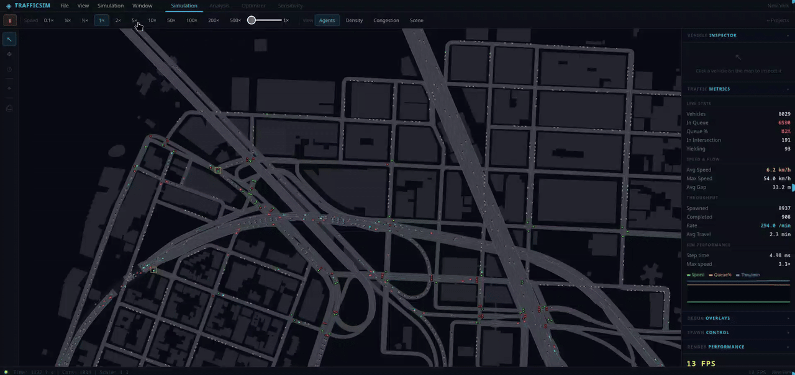
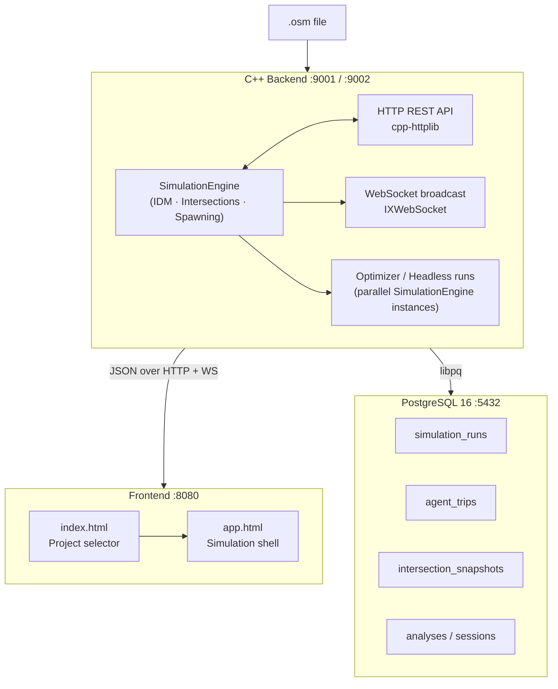

# Traffic Simulation

[](https://github.com/Jakub-Kos/trafficsim/actions/workflows/docker-publish.yml)
[](LICENSE)



A C++23 road traffic simulation engine built for a bachelor's thesis. It loads real OpenStreetMap data, simulates vehicles using the **Intelligent Driver Model (IDM)**, and exposes a REST + WebSocket API consumed by a WebGL frontend. The primary research use case is **road network optimization** — finding optimal road closures, construction schedules, or pedestrianization candidates by running the simulation as a fitness function.



---

## Documentation

| Document                                         | Contents                                                           |
|--------------------------------------------------|--------------------------------------------------------------------|
| [Architecture](docs/ARCHITECTURE.md)             | System topology, data flows, threading model                       |
| [Simulation internals](docs/SIMULATION.md)       | IDM physics, agent controllers, intersection reservations, routing |
| [API reference](docs/API.md)                     | All HTTP endpoints + WebSocket protocol                            |
| [Frontend](docs/FRONTEND.md)                     | Page structure, WebGL pipeline, view modes                         |
| [Analytics system](docs/ANALYTICS.md)            | PostgreSQL schema, fitness scoring, headless analysis              |

---

## Repository layout

```
rp-kos/
├── src/
│   ├── include/                  # C++ headers (.hpp) — one per class
│   ├── src/                      # C++ implementations (.cpp)
│   └── data/                     # Default .osm map file (map.osm) and legacy testing .json files
├── frontend/                     # Vanilla JS + WebGL 2.0 frontend (no build step)
│   ├── index.html / index.js     # Project selector page
│   ├── app.html / app.js         # Main simulation shell (menubar, inspector, metrics)
│   ├── loading.html / loading.js # Loading / initialization screen
│   ├── renderer.js               # WebGL 2.0 road + vehicle rendering
│   ├── main.js                   # Frame loop, input, vehicle interpolation
│   ├── net.js                    # HTTP + WebSocket communication
│   ├── viewport.js               # Camera: pan, zoom, world ↔ screen
│   ├── scene.js                  # Background OSM tile rendering
│   ├── osm.html / osm.js         # OSM file import UI
│   ├── optimizer.js              # Optimizer controls and fitness display
│   ├── sensitivity.js            # Sensitivity analysis controls
│   └── perf.js                   # FPS / performance overlay
├── docs/                         # Technical documentation (see table above)
│   └── images/                   # Screenshots
├── db/
│   └── init.sql                  # PostgreSQL schema: analytics + optimizer tables
├── projects/                     # Per-project data; volume-mounted in Docker
│   └── <Name>/
│       ├── meta.json             # Project name, description, timestamps
│       └── map.osm               # OSM map file saved for this project
├── Dockerfile                    # Backend: Ubuntu 24.04 multi-stage build → binary
├── Dockerfile.frontend           # Frontend: nginx:alpine serving static files
├── Dockerfile.db                 # Database: PostgreSQL 16 with init.sql pre-applied
├── docker-compose.yml            # Orchestrates all three services + pgdata volume
├── nginx.conf                    # Serves frontend; proxies HTTP API calls to backend
├── CMakeLists.txt                # C++23 build; FetchContent deps; optional TBB detection
├── simulation.json               # Runtime config: ports, vehicle physics, routing params
└── .gitlab-ci.yml                # CI: Kaniko builds → Docker Hub on git tag push
```

---

## Third-party libraries

| Library                                                     | Version   | License      | Purpose                                   |
|-------------------------------------------------------------|-----------|--------------|-------------------------------------------|
| [nlohmann/json](https://github.com/nlohmann/json)           | 3.11.3    | MIT          | JSON serialization / deserialization      |
| [cpp-httplib](https://github.com/yhirose/cpp-httplib)       | 0.15.3    | MIT          | Embedded HTTP REST server                 |
| [IXWebSocket](https://github.com/machinezone/IXWebSocket)   | 11.4.6    | BSD-3-Clause | WebSocket server for live state broadcast |
| [tinyxml2](https://github.com/leethomason/tinyxml2)         | 10.0.0    | zlib         | OSM XML map file parsing                  |
| [libpq](https://www.postgresql.org/docs/current/libpq.html) | system    | PostgreSQL   | PostgreSQL client (analytics DB)          |
| [Intel TBB](https://github.com/oneapi-src/oneTBB)           | system    | Apache-2.0   | Parallel agent updates (optional)         |

All FetchContent libraries are downloaded automatically at CMake configure time. System libraries (`libpq`, TBB) must be installed separately — see [Building from source](#building-from-source-local-development).

---

## Running with Docker (recommended)

This is the easiest way to run the project on any machine with Docker installed.

### Prerequisites

- [Docker](https://docs.docker.com/get-docker/)
- [Docker Compose](https://docs.docker.com/compose/install/) (included with Docker Desktop)

### Setup

1. Create an empty folder anywhere on the machine, e.g. `trafficsim/`.

2. Download `docker-compose.yml` from this repository into that folder.

3. Pull and start (the images are pulled automatically from the default registry — no `.env` needed unless you want to pin a specific release):

```bash
docker compose pull
docker compose up
```

To pin a specific release, create a `.env` file in the same folder with:

```
IMAGE_TAG=v1.0.0
```

4. Open **http://localhost:8080** in your browser.

To stop: `Ctrl+C`, or `docker-compose down` to also remove containers.

> **Projects** are stored in `./projects/` inside the folder you created and persist across restarts.

> **Ports in Docker mode:** nginx on `:8080` serves the frontend and proxies HTTP API calls to the backend internally. The WebSocket is exposed directly on `:9002`. The backend's HTTP port `:9001` is not reachable from the host — all API traffic goes through nginx.

---

## Building from source (local development)

### Prerequisites

- CMake 3.27+
- C++23 compiler (g++ or clang++)
- `libpq-dev` (PostgreSQL client library)
- Optional: `libtbb-dev` for parallel agent updates

### Build

```bash
cmake -B build
cmake --build build
```

Output binary: `build/bin/TrafficSimulation`

### Run

**Backend:**
```bash
./build/bin/TrafficSimulation
# HTTP on :9001, WebSocket on :9002
```

**Frontend:**
```bash
cd frontend && python3 -m http.server 8080
# http://localhost:8080
```

**Database (optional — needed for analytics):**
```bash
docker-compose up -d db
```

Without the database, all analytics calls silently no-op and the simulation runs fine.

---

## Configuration

Edit `simulation.json` to change the default map file, ports, vehicle physics, and other parameters.

---

## Generating API documentation

[Doxygen](https://www.doxygen.nl/) is required. Install it via your package manager:

```bash
# Ubuntu / Debian
sudo apt install doxygen

# macOS
brew install doxygen
```

Then from the repository root:

```bash
doxygen Doxyfile
```

The generated HTML documentation will be written to `docs/doxygen/html/`. Open `docs/doxygen/html/index.html` in a browser to browse the class and file reference.

> **Note:** `HAVE_DOT = YES` is set in the Doxyfile, so [Graphviz](https://graphviz.org/) is also required for class/call graphs (`sudo apt install graphviz` or `brew install graphviz`). Without it, Doxygen will warn but still produce HTML.