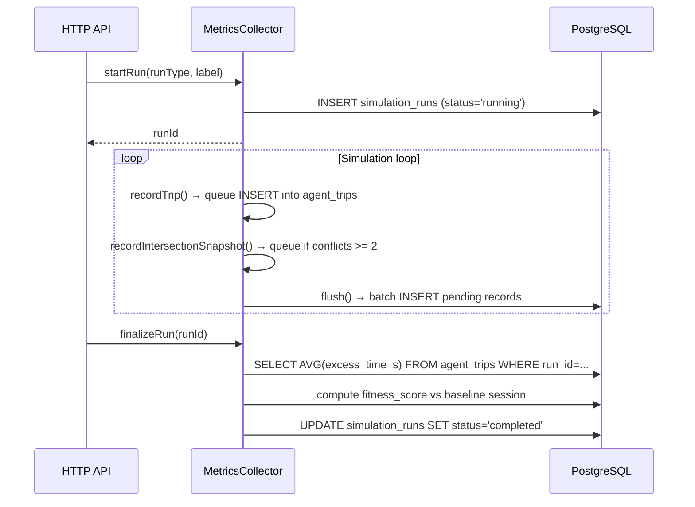

# Analytics & Metrics System

The analytics system is **optional** — the simulation runs fine without a database. All `MetricsCollector` methods silently no-op if the DB connection is unavailable.

---

## Starting the database

```bash
docker-compose up -d db
```

`docker-compose.yml` starts PostgreSQL 16 on port 5432. The schema is applied automatically from `db/init.sql`. Default credentials:

```
Host:     localhost:5432
Database: traffic_sim
User:     postgres
Password: postgres
```

Override the connection string with the `POSTGRES_URL` environment variable before starting the backend.

---

## PostgreSQL schema

```sql
simulation_runs                     -- one row per simulation run
  run_id                     TEXT  PRIMARY KEY
  project_name               TEXT
  run_type                   TEXT   -- 'baseline' | 'scenario' | 'optimization'
  label                      TEXT
  status                     TEXT   -- 'running' | 'completed' | 'failed'
  closed_road_ids            JSONB  -- OSM way IDs closed for this run
  sim_duration_s             FLOAT
  vehicles_spawned           INT
  vehicles_completed         INT
  completion_rate            FLOAT  -- vehicles_completed / vehicles_spawned
  total_excess_vehicle_hours FLOAT
  avg_excess_time_per_trip_s FLOAT
  avg_freeflow_all_spawned_s FLOAT  -- Σfreeflow over ALL spawned agents / spawned
  danc_score                 FLOAT  -- Demand-Adjusted Network Cost (s/vehicle)
  baseline_run_id            TEXT REFERENCES simulation_runs
  fitness_score              FLOAT  -- danc_scenario / danc_baseline (NULL for baseline)
  session_id                 TEXT REFERENCES analysis_sessions

agent_trips                         -- one row per completed vehicle journey
  run_id                     TEXT  REFERENCES simulation_runs
  agent_id                   BIGINT
  spawn_time_s               FLOAT
  complete_time_s            FLOAT
  actual_travel_time_s       FLOAT
  freeflow_estimate_s        FLOAT  -- ideal time at speed limit with zero traffic
  excess_time_s              FLOAT  -- max(0, actual - freeflow)
  reroute_count              INT

intersection_snapshots              -- periodic congestion sampling (~60 sim-s intervals)
  run_id                     TEXT  REFERENCES simulation_runs
  sim_time_s                 FLOAT
  intersection_id            BIGINT
  locked_conflicts           INT    -- only recorded when >= 2

analyses                            -- top-level comparison study group
  analysis_id                TEXT  PRIMARY KEY
  project_name               TEXT
  name                       TEXT
  sim_seed                   BIGINT -- shared RNG seed for fair comparisons

analysis_sessions                   -- N parallel runs per configuration
  session_id                 TEXT  PRIMARY KEY
  analysis_id                TEXT  REFERENCES analyses
  name                       TEXT
  traffic_mode               TEXT   -- 'low' | 'medium' | 'high'
  run_count                  INT
  sim_duration_s             FLOAT
  closed_road_ids            JSONB
  status                     TEXT
  is_baseline                BOOLEAN
  baseline_session_id        TEXT
  avg_fitness_score          FLOAT
  avg_excess_vehicle_hours   FLOAT
  avg_excess_time_per_trip_s FLOAT
  avg_completion_rate        FLOAT
  avg_danc_score             FLOAT
  avg_danc_comparable        FLOAT  -- normalized against baseline spawned count
```

---

## Fitness scoring

**Freeflow estimate** (computed at agent spawn):
```
freeflow = Σ(lane.length / lane.speedLimit)  for all lanes in route
```
This is the ideal travel time at the posted speed limit with zero traffic.

**Excess time per trip:**
```
excess = max(0, actual_travel_time - freeflow)
```
A vehicle that travels at the speed limit has excess = 0. A delayed vehicle accumulates positive excess.

**DANC — Demand-Adjusted Network Cost:**

Simple `avg_excess_time` ignores vehicles that never reach their destination (despawned or still running at sim end). DANC penalizes unserved demand:

```
T_penalty = max(300, avg_freeflow_all_spawned × 2)   [seconds]

DANC = (Σ excess_time_completed + unserved_count × T_penalty) / vehicles_spawned
```

`DANC` is in seconds per spawned vehicle. A scenario with fewer completions or longer delays produces a higher DANC.

**Fitness score (per-run comparison):**
```
fitness_score = DANC_scenario / DANC_baseline

  < 1.0  → scenario is better (less delay per vehicle)
  > 1.0  → scenario is worse
  NULL   → baseline run itself
```

**DANC-comparable (cross-scenario normalization):**

When comparing multiple scenarios within an analysis, `avg_danc_comparable` divides by the *baseline* spawned count rather than each session's own count, making the denominator the same across all sessions in the group.

---

## Optimizer tables

Two additional tables track optimization runs separately from analysis sessions:

```sql
optimization_problems               -- problem definition (stays constant across runs)
  problem_id           UUID  PRIMARY KEY
  project_name         TEXT
  name                 TEXT
  candidate_road_ids   JSONB  -- roads the optimizer may close
  phase_count          INT    -- how many construction phases
  sim_duration_s       FLOAT
  traffic_mode         TEXT   -- 'low' | 'medium' | 'high'
  scenario_type        TEXT   -- e.g. 'phased_construction'
  constraint_threshold FLOAT  -- max allowed fitness ratio per phase

optimization_sessions               -- one optimizer run (algorithm + hyperparams → result)
  session_id           UUID  PRIMARY KEY
  problem_id           UUID  REFERENCES optimization_problems
  algorithm            TEXT  -- 'hill_climbing' | 'simulated_annealing' | 'evolutionary'
  hyperparams          JSONB -- algorithm-specific settings
  status               TEXT  -- 'running' | 'paused' | 'completed' | 'failed'
  iterations_done      INT
  evals_done           INT
  best_fitness         FLOAT
  baseline_danc        FLOAT
  best_assignment      JSONB -- best phase→road mapping found
  best_phase_fitnesses JSONB -- per-phase fitness of the best assignment
  convergence_history  JSONB -- [fitness] over iterations, for plotting
```

---

## Run lifecycle



---

## Headless analysis workflow

Used to compare road configurations without live visualization overhead.

```
POST /analysis/start {analysisId, label, runCount, simDurationS, trafficMode}
  → Spawns runCount worker threads
  → Each thread:
      1. Creates fresh SimulationEngine (same OSM, same sim_seed)
      2. Applies road closures (if scenario run)
      3. Steps as fast as possible (no WS broadcast, no 30fps cap)
      4. On completion: flush metrics to DB, finalize run
  → Returns sessionId

GET /analysis/:id/status
  → Returns [{runId, progress: 0.0–1.0}] for all runs in session

DELETE /analysis/:id
  → Cancels running threads, marks runs as failed
```

**Isolation:** Each worker gets its own `SimulationEngine` — no shared simulation state. The DB connection is the only shared resource (one connection per thread).

---

## Using analytics from the frontend

The analytics UI lives inside `app.html` (the main simulation shell) — there is no separate analytics page. Open `http://localhost:8080`, load a project, then click the **Analysis** tab in the top menubar.

**Workflow:**

1. **Create an analysis** — click **+ New**, give it a name. This creates an analysis group with a shared RNG seed so all simulations in it are comparable.

2. **Add a baseline simulation** — with no roads closed on the map, click **+ Add Simulation** inside the analysis. Set a label (e.g. "Baseline"), pick run count, traffic density, and sim duration, then click **▶ Run Simulation**. N parallel headless runs start immediately; a progress bar polls the status.

3. **Add scenario simulations** — close some roads on the map using the road editor, then add another simulation to the same analysis (e.g. "Close Main St"). Road closures are captured automatically from the current map state at the moment you click Run.

4. **View results** — click any completed simulation in the sidebar to see:
   - Key stats: vehicles spawned, completion rate, avg delay, DANC score, fitness vs. baseline
   - Travel time distribution histogram
   - Intersection hotspots (top 15 by locked-conflict count, drawn on a minimap)

5. **Compare** — click an analysis group header to open the comparison table: all sessions side by side with DANC fitness scores and a bar chart.