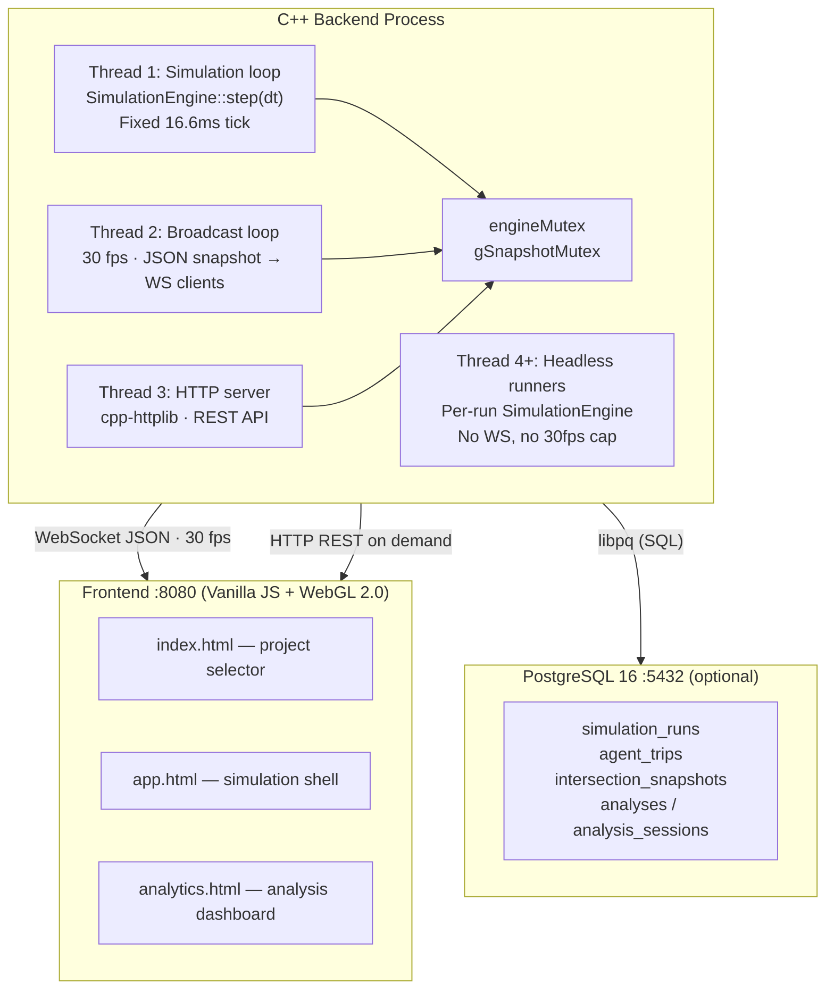
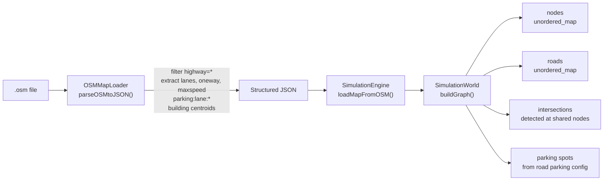
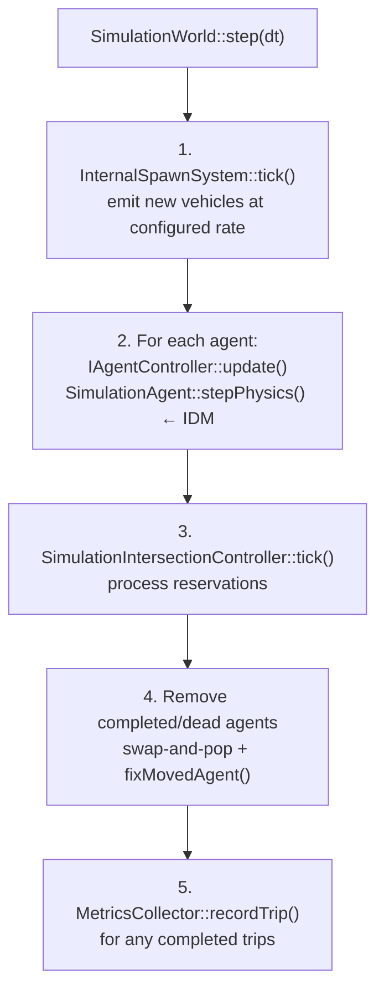
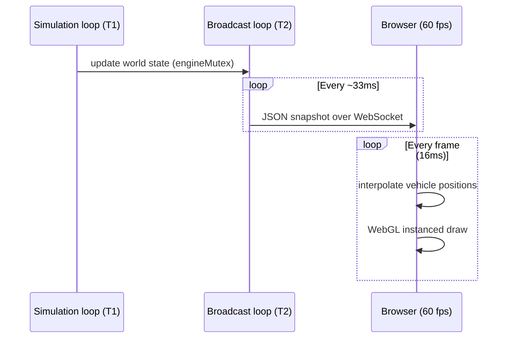
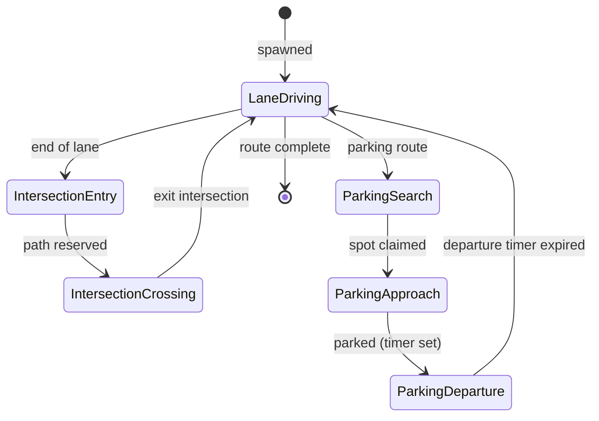

# Architecture

## System topology



---

## Backend source layout

```
src/
  include/   ← all .hpp headers
  src/        ← all .cpp implementations
```

**Entry point:** `src/src/main.cpp` — wires up threads, registers all HTTP routes, owns the global `SimulationEngine` instance.

### Core classes

| Class | Role |
|---|---|
| `SimulationEngine` | Public API — PIMPL wrapper. All external code calls this. |
| `SimulationWorld` | Owns all state: nodes, roads, lanes, intersections, agents, spawner, planner, parking |
| `SimulationAgent` | Vehicle: position, heading, speed, IDM physics, active controller |
| `SimulationRoad` | OSM way → multiple directed `SimulationLane`s with lateral offsets |
| `SimulationLane` | Ordered agent queue, centerline geometry, capacity |
| `SimulationIntersection` | Shared node, all turning paths, controller |
| `SimulationIntersectionController` | Reservation-based conflict avoidance |
| `AgentControllers` (6 impls) | Strategy pattern: high-level agent decisions |
| `InternalRoutePlanner` | Dijkstra on lane graph, congestion-aware costs, route cache |
| `InternalSpawnSystem` | Bounding-box spawn regions, rate-based vehicle creation |
| `ParkingSystem` | Spot generation from OSM tags, occupancy tracking |
| `OSMMapLoader` | Parses `.osm` XML → structured map JSON consumed by `SimulationEngine` |
| `MetricsCollector` | Writes trip/intersection data to PostgreSQL |

---

## Data flow: OSM → simulation



---

## Data flow: simulation tick



---

## Data flow: render frame



---

## Agent controller state machine



---

## Agent pool memory model

Agents are stored as **value objects** in a pre-allocated `std::vector` (capacity 16,384 by default, configurable in `simulation.json`).

- Lane queues hold **raw non-owning pointers** to agents
- Addresses are stable because the vector never reallocates past its initial capacity
- Removal uses **swap-and-pop** followed by `fixMovedAgent()`, which updates all lane queue pointers to the swapped agent's new address
- Every new removal path must call `fixMovedAgent()` — failure produces dangling pointers

---

## Headless simulation (optimization use case)

`POST /analysis/start` spawns N worker threads, each running:

1. A fresh `SimulationEngine` loaded with the same OSM map
2. Optionally with modified road closures applied
3. Stepped as fast as possible (no WS broadcast, no 30 fps cap)
4. Metrics flushed to PostgreSQL on completion

Multiple headless runs compare baseline vs. modified scenarios to compute fitness scores. See [Analytics](ANALYTICS.md) for the scoring formula.