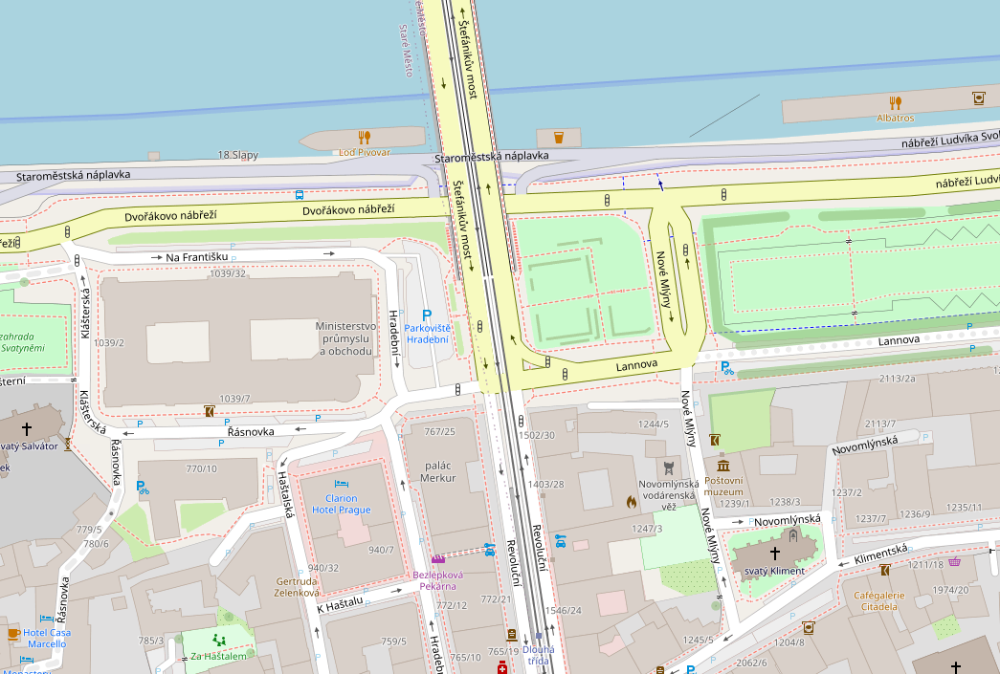
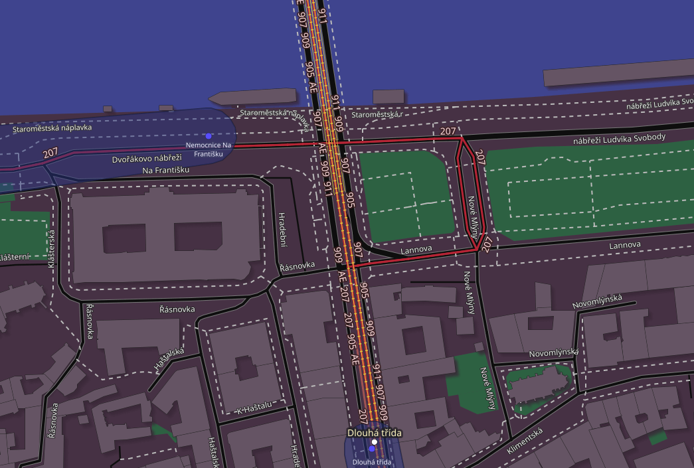
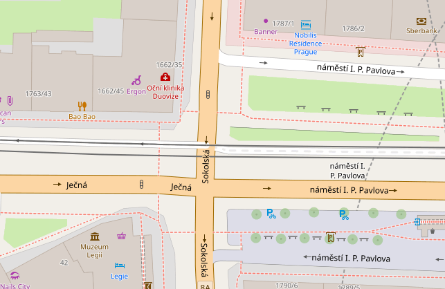
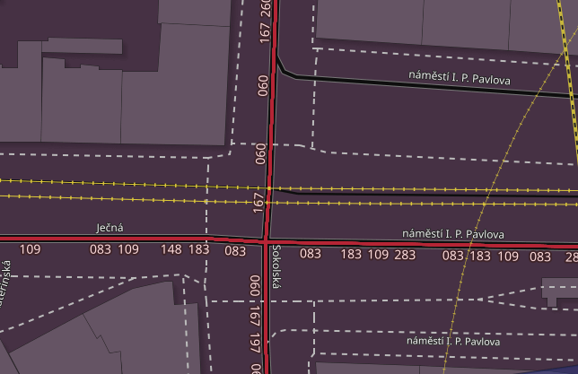
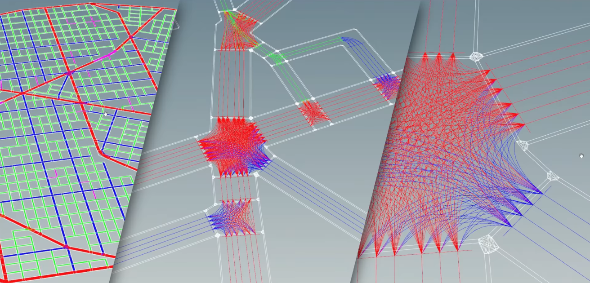

# Analysis of possible approaches to semestral project

* [Introduction](#1-introduction)
* [Basic blocks of simulation](#2-basic-blocks-of-simulation)
* [Approaches to search in simulation](#3-approaches-to-search-in-simulation)
* [Traffic network](#4-traffic-network)
* [Usage of real-world data](#5-usage-of-real-world-data)
* [Possible extension](#6-possible-extension)
* [Summary](#7-summary)
* [Sources](#8-sources)

## 1. Introduction
The implementation of this project can be done in many different ways. Each approach has its pros and cons. This document serves as summary of these different approaches and ultimately reasons behind choosing the one for this project.

---
## 2. Basic blocks of simulation

### 2.A. Rendered transport network
The transport network will be represented similarly to the **OSM** data (OpenStreetMap, a community-created geographic data base). That is because there are good reasons for OSM to be implemented in this way and also because I want to leave room for possible support for this data.

Basic workings of OSM

The basic **OSM elements** are points (**Nodes**), paths (**Ways**) and relations (**Relations**):
1. The key element is **Node**, it contains **id**, **lat/long** positions and **Tags**
2.	This is logically followed by **Way** element, which contains a list of **Nodes** and **Tags**
3.	Finally, the **Relation** element contain a list of **Members** and also **Tags**. **Members** are always an **Element**, **Role** pair.

For **Nodes**, they can only be rendered as single points, as they have no logical connection to other points.
For **Ways**, they can be rendered as lines or polygons. If polygon data is stored as Ways, it is because their shape is not complex.
For **Relations**, it is true that they are plotted as lines or polygons. They store complex groupings of routes, buildings, etc. Relations with the Multipolygon tag are interesting, as they have **Members** with the **inner** or **outer** role, and add to or "bite off" the resulting shape of the element accordingly.

**Main network element implementation variants:**
> ⚠️ This section mainly discusses the problems in input data and also problems for map-like rendering. The **rendering** part will be given its own section if there will be reason to implement it. This project aims to make solid simulation of traffic and not nice looking cities.

- **Roads**
    - ✅**Polylines** - Simple collection of linear lines (line segments)
      ✅ Pros: straightforward, simple, efficient
      ❌ Cons: not smooth, vehicle jitter at segment ends
    - ❌**Splines** (special polyline - curve lines)
      ✅ Pros: smooth curves, better vehicle motion
      ❌ Cons: computationally expensive, harder collision detection
  > ✅ I chose **polylines** for their simple implementation and faster computation. Also this project doesn't aim to simulate at LODs (level of detail) that would require splines.

    - Next problem is that OSM data for roads is stored somewhat efficiently, multilane roads are differentiated only by **Tags**
  > ❌ Plan for somewhat procedural generation of the roads needs to be devised. That is if visibility of different road markings is the goal. The simpler option is to do it as all map programs (the more lanes, the thicker the lines, *example below*)
  > Example A             |  Example B
  > :-------------------------:|:-------------------------:
  >   | 

- **Intersections**
    - At each node where two different ways meet problems arise. All of these points can be considered as "intersections". If we render more than just lines, e.g. rectangles with textures, the different segments may appear disconected from each other.
      > ⚠️ When rendering as lines this will most likely not be a problem
    - The real problems arise at the real intersections:
      Example A             |  Example B
      :-------------------------:|:-------------------------:
        | 

      It may not look like it, because this style of rendering hides the problem. **All agents passing through this intersection pass through one point that is in the center!**
      > There may be multiple solutions to this, but one particularly solid approach that inspired me—and that I aim to replicate—comes from a video [EPC2022 | Robert Osborne | Building a City in the Matrix Awakens Experience](https://www.youtube.com/watch?v=p570CXrCmDQ&list=PL8oz0jJROxCSDjzRDYN2gpOoa8ZVrEdhn&index=12&t=2063s). I will make dedicated section for this approach

- **Buildings**
    - Rendering buildings will only increase visual appeal, that is if they will not take part in the simulation.
    - Buildings should be stored in OSM style, for this two approaches would need to be implemented:
        - Convex buildings → sf::ConvexShape
        - Complex buildings with holes → Usage of triangulation (e.g., ear clipping, ClipperLib)
  > ❌ As of now I am not sure if buildings should be considered in agent simulation

### 2.B. Agents (vehicles)
The agents need to have:
* inner logic
* routes (spawn points and destinations)
* box collider and sprite

### 2.C. Interaction for agent-agent and agent-surrounding

### 2.D. Camera (Scene view)
I would like to have dynamic camera that is not fixed to one location.
This enables LODs for larger maps and easier debugging.
Because we will store data in **lat/lon** format, the camera needs to have the same parameter.

### 2.E. Traffic network
For this I dedicated separate [section](#4-traffic-network)

---
## 3. Approaches to search in simulation
Each agent will need to understand its surrounding and act upon it. That is to have active lane it is following, knowing where it ends and if there is some obstacle (that could be traffic lights). Also it needs to know about other agents to not collide with them. For this different aproaches for searching can be employed.

### 3.A Raycasting
Casting rays to all objects and getting back distance information.
### 3.B Quadtree
Efficient way to store neighbouring agents.
### 3.C 2D Grid
Reservation system cited in ///
### 3.D Combination of A and B
We can take inspiration from 3D rendering, where the raytracing is used with octrees for more efficient search.

---
## 4. Traffic network
This is the **core** of the simulation. All agents will take information from this and act upon it. It consists of these data:
1. Intersections
2. Traffic lanes
3. Traffic direction
4. Traffic lights and other obstacles

> ⚠️ The goal for this data is [EPC2022](https://www.youtube.com/watch?v=p570CXrCmDQ&list=PL8oz0jJROxCSDjzRDYN2gpOoa8ZVrEdhn&index=12&t=2063s) style. Image is more powerful than words, so example below:

### 4.A Intersections

### 4.B Traffic lanes

### 4.C Traffic directions

### 4.D Obstacles
We can employ different types of "obstacles" for the simulation. In core these are only elements that make the agent stop or slow down. These are:
1. Speed zones
2. Simple right of way
3. Parking
4. Traffic lights
5. Stop signs
6. Pedestrian Crosswalks
    - This implies simulation of pedestrians...

---
## 5. Usage of real-world data
### 5.A Source formats and APIs (OpenStreetMap, GTFS, etc.)
There is a possibility of using existing data for simulations in real cities. Also formats like GTFS offer real public transportation schedules.
* [OSM API](https://wiki.openstreetmap.org/wiki/API#REST_specifications_for_the_editing_API)
* [PID Opendata](https://pid.cz/o-systemu/opendata/)

### 5.B Access to traffic modelling based on real data
There are real-life traffic models available. They can be used to predict how traffic should behave in a simulation under different circumstances.
* [MAPBOX Sample Data](https://www.mapbox.com/traffic-data)
* [Kaggle Traffic flow prediction Datasets](https://www.kaggle.com/discussions/general/68034)
* [Trafikkdata (National Data Catalog of Norway)](https://data.europa.eu/data/datasets/http-vegvesen-no-datasett-id_ikke_permanent-trafikkdata?locale=en)

---
## 6. Possible extension
At this point in time it isn't clear in which direction will my bachelor thesis take me. I have a few ideas for some "research" that can be done using this project, so I aim to leave room for easy implementation of the following.

> This list will probably grow as time progresses. I aim to place my ideas here, even when they will make little sense to me the next day.

### 6.A Study of possible roads feasible for closure and transformation into pedestrian zones
As the concept of the 15-minute city gains attention, the need for better pedestrian infrastructure becomes increasingly important. Transitioning from car-centric cities to pedestrian-friendly ones is a noticeable trend, but it is a gradual process that requires careful planning. In the meantime, a balance must be struck between accommodating both pedestrians and vehicles. This can be achieved by creating new pedestrian zones or reducing speed limits in certain areas.

### 6.B Bike network
Prague has a bike network, but from personal experience, it feels fragmented and often conflicts with car traffic. The goal should be to design more efficient and denser cycling routes, creating a better experience for both cyclists and drivers.

### 6.C Generation of public transportation routes
Given a blank slate (that be a city), this project aims to determine optimal routes for various types of public transport. The goal is to balance cost, waiting times, travel speed for passengers, with the amount of available buses, trains, trams, etc.

### 6.D Redesign of public transportation based on existing infrastracture
Similar to the previous concept. The difference is that we know the amounts of avaible vehicles, stops, etc. . The goal is to assess whether existing public transport systems are operating at maximum efficiency.

### 6.E Study of routes used by Emergency services
The question here is whether the shortest routes for emergency vehicles actually lead to the fastest arrival times. Although these "agents" don’t have to follow basic traffic laws, it doesn’t necessarily mean that the current traffic won't obstruct them. In some cases, alternative routes might result in faster arrivals.

---
## 7. Summary
### 7.A Base blocks
This project can be summarised by these key blocks:
- [x] Traffic network
- [ ] Simulation Agents
- [ ] Input data
### 7.B Undecided options

===
## 8. Sources
Here I list sources I found relevant to this project and ideas I took from them.

### 8.A Road Maintenance Planner (RoMaP) - Traffic Simulator by Marek Zelený
This thesis starts of solid, with the **Requirements** part providing coherent and clear intention of the project.

Therefore I can say I want to implement:
* Traffic Model
    * Microscopic, space&time-continuous simulation
* Platform and Interface
    * Windows (possibly Linux) application
    * Graphical interface
* Road Network
    * 2D Node based road network (possibility of layer as "third" dimension)
    * Graphical road network designer and editor
    * Saving and loading maps
* Roads
    * Road properties: length, shape, maximal speed, number of lanes, bi/onedirectional
* Crossroads
    * Priority crossing
    * Right-of-way
    * Traffic lights
* Agents
    * Agents - Cars (with possibility of buses, motorbikes, trams)
    * Behaviour - Car-following model THIS NEEDS TO BE DECIDED (Gipps’ model, Newell’s model, Intelligent Driver Model)
    * Goal - Agents follow fastest route to a destination (that be considering traffic for some of the agents)
    * Spawn - Control of traffic density, that is zones or desired road throughput
* Agents - Behaviour
    * IDM is widely accepted and good for realistic urban simulations - further research needed
* Agents - Navigation
    * Passive navigation (fixed at spawn based on max-speed paths)
    * Active navigation (dynamic routing based on current traffic conditions)
    * Centralized Routing Cache (for Active Nav)
        * Stores shortest paths
        * Caches and lazily recomputes them when conditions change
* Statistics
    * Collect statistics - that is throughput of roads and crossroads
    * Display real-time statistics during simulation
    * Export of statistical data
    * ❓ Support headless mode for large/batch runs

Because this project aims to do mesoscopic model with square-grid road network I can only take some inspiration from this.

### 8.B Traffic – hra se simulací silniční sítě by Matěj Kripner
Even though this thesis has more than 100 pages, it mainly focuses on Unity and has not that much information about traffic.

* Road Geometry
    * ❌ Road shapes defined via cubic Bézier curves
  > This only adds unnecessary complexity
* ❓Sidewalks and Pedestrians
    * Sidewalks run independently or alongside roads, and are part of the walkable network
    * Pedestrians move between houses and avoid obstacles and each other
  > If I plan for future pedestrian simulation or support for walking/cycling zones, this structure would be useful
* Automatic Intersection Shaping
    * Crossroads’ shapes are auto-generated based on the angles and connections of Bézier curves
* Modular World Loading
    * World is structured to load/unload map sections dynamically, supporting very large worlds
* Integrated world editor
    * Snaps road endpoints
    * Allows drag & drop placement and duplication

### 8.C Inteligentní křižovatka by Věra Škopková
The scope of this thesis makes some aspects unusable for this project but has really solid points for inspiration.

* Local Intersection Management (Inspired by Reservation Systems)
    * Instead of a grid, each intersection in the simulation consists of input/output points for each road
    * Possibilty of lightweight local reservation system per intersection:
        * Each agent (car) requests permission before entering the intersection
        * A small intersection manager decides if the agent's pre-defined path is temporally and spatially conflict-free with others
        * If not, the agent waits at the entry point
  > Allows agents to behave independently while preventing collisions and deadlocks at high-traffic nodes
* Vehicle Size and Geometry (LA-MAPF Inspiration)
    * Roads have multiple lanes, and intersections have several entry/exit points — so:
        * Model vehicles with different lane occupancy or turn radius
        * Larger vehicles may need wider intersection paths or turn delays
* Evaluating Performance
    * Even without MAPF, we can borrow evaluation metrics:
        * Total travel time (sum of costs)
        * Max travel time (makespan)
        * Intersection throughput
        * Average delay per car

### 8.D Efektivita centralizovaného plánování křižovatek by Eliáš Cizl

* Conflict Detection Models
    * Instead of uniform grid-based occupancy, this thesis favors trajectory-based conflict detection:
        * Paths through the intersection are analyzed for conflict points
        * Time-based conflicts are checked using a model like DTOT (Discrete-Time Occupancies Trajectory)
  > We could precompute entry→exit path conflict sets, and allow or deny entry to agents based on time-slot overlaps at those points
* Agent - Behaviour
    * Max speed is adjusted automatically based on turn sharpness
  > We could adopt a similar curve-based speed limit system, tying speed profiles to road geometry (e.g., sharper turns = lower speed cap)