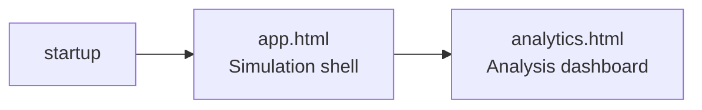

# Frontend Architecture

The frontend is vanilla JS + WebGL 2.0, served statically (no build step). It communicates with the C++ backend over HTTP and WebSocket.

---

## Pages

| File | Purpose |
|---|---|
| `index.html` + `index.js` | Project selector — list, create, rename, delete projects |
| `app.html` + `app.js` | Main simulation shell — menubar, inspector dock, metrics dock |
| `loading.js` | Full-screen loading spinner shown during map initialization |
| `sim.html` | Legacy direct simulation viewer — deprecated, replaced by `app.html` |

**Navigation flow:**



---

## JavaScript modules

### Communication
- **`net.js`** — HTTP fetch wrappers + WebSocket connection manager. All backend calls go through here.

### Rendering
- **`renderer.js`** — WebGL 2.0 hardware-accelerated rendering (roads, vehicles, parking, debug overlays)
- **`viewport.js`** — Camera: pan, zoom, world ↔ screen coordinate transforms
- **`scene.js`** — Background OSM tile map rendering

### Simulation client
- **`main.js`** — Frame loop, input handling, vehicle interpolation, inspector updates

### UI
- **`app.js`** — App shell: menubar actions, dock panel sections (inspector, metrics, spawning stats)
- **`perf.js`** — Frame timing / FPS counter

### Utilities
- **`map-selector.js`** — OSM file upload + parsing UI
- **`osm.js`** — OSM element helpers (relation parsing)
- **`optimizer.js`** — Optimizer controls and fitness display
- **`sensitivity.js`** — Sensitivity analysis controls

---

## WebGL rendering pipeline

**Shaders (GLSL ES 3.0):**

`FLAT_VERT / FLAT_FRAG` — Solid-color polylines
- Used for: roads, intersection circles, debug geometry
- Input: per-vertex positions, uniform color + view matrix

`VEHICLE_VERT / VEHICLE_FRAG` — Instance-rendered vehicle quads
- Per-instance: world position (x, y), heading (radians), RGB color, acceleration value
- Per-vertex: unit quad corner offset (4 vertices)
- Fragment: rounded-rect SDF, windshield highlight strip, brake light tint

**Render order each frame:**
1. Background (OSM tile textures)
2. Road network (flat shaded polylines with miter joints)
3. Intersections (circles at shared nodes)
4. Vehicles (instanced quads, rotated by heading)
5. Parking spots (small diamond markers)
6. Debug overlay — only when inspector is open: hitboxes, waypoints, route path

**Performance:**
- Single instanced draw call for all visible vehicles per frame
- Server-side viewport culling: only vehicles in camera bounds sent over WS
- ~5ms GPU time at 150 vehicles; ~20ms at 1000 vehicles

---

## Rendering coordinates

The simulation uses **metric world space** (meters, origin at map center). The frontend transforms world → screen via the viewport camera matrix. All positions in WS messages are in meters.

---

## Frame loop and interpolation

The server broadcasts at **30 fps** (~33ms). The client renders at **60 fps**.

```
WebSocket message received:
  → update vehicleTargets[id] = {x, y, heading, speed, ...}

Each render frame (60 fps):
  → for each vehicle:
       lerp position toward target    (smooth motion between WS updates)
       slerp heading
  → WebGL instanced draw
```

---

## Frontend state (main.js)

| Variable | Contents |
|---|---|
| `mapData` | Static map received once on load (roads, lanes, intersections) |
| `vehicleTargets` | `Map<id, latest WS data>` |
| `vehicleRenderStates` | `Map<id, interpolated render data>` |
| `selectedId` | Vehicle being inspected (-1 if none) |
| `followMode` | Camera tracks selected vehicle |
| `currentSimTime` | Simulation clock (from WS) |
| `detailedInfo` | Rich data from `GET /vehicle/detail` (on demand) |
| `lastIntersections` | Intersection states from last WS message |
| `isPaused` | `timeScale == 0` |

---

## View modes

Controlled by `setStreamMode` WS command sent from the frontend:

| Mode | Server sends | Frontend renders |
|---|---|---|
| `agents` | `vehicles[]` array | Individual vehicle quads (default) |
| `density` | `density` grid | Canvas heatmap overlay |
| `congestion` | `laneStats[]` | Per-lane color tinting |

The mode can be switched at runtime without reloading.

---

## Inspector panel

Clicking a vehicle sends `GET /vehicle/detail?id=<id>` and opens the inspector dock showing:
- Current speed, acceleration, gap to leader
- Active controller name
- Route remaining (lane sequence)
- Position history (last N positions drawn on canvas as trail)
- Hitbox visualization (rendered in WebGL debug layer)

---