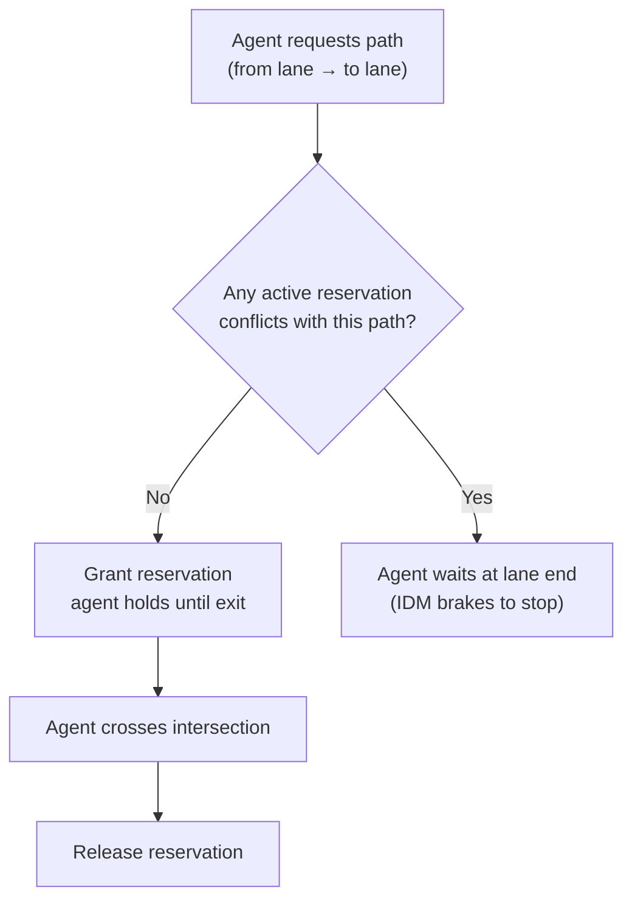

# Simulation Engine Internals

## SimulationEngine public API (PIMPL)

The only surface external code should touch. `SimulationWorld` is the internal implementation and must not be accessed directly.

| Method                                  | Description                                              |
|-----------------------------------------|----------------------------------------------------------|
| `loadMapFromOSM(osmData)`               | Parse OSM XML, build road/lane/intersection graph        |
| `setGlobalMapParameters(params)`        | Lane width, speed limit defaults, curb radius            |
| `addVehicleType(config)`                | Register vehicle physics profile                         |
| `defineRoute(route)`                    | Register named lane sequence                             |
| `addSpawnRegion(config)`                | Set up bounding-box spawn area                           |
| `step(deltaTime)`                       | Advance physics one tick                                 |
| `getVehicleStatesInBounds(bounds)`      | Minimal vehicle data for rendering                       |
| `getDetailedVehicleState(id)`           | Full state + hitbox + position history                   |
| `getMetrics()`                          | Aggregated counts/speeds                                 |
| `getVehicleHeatmap(bounds, resX, resY)` | KDE density grid                                         |
| `getLaneTrafficStats()`                 | Per-lane count/speed/stuck                               |
| `getMapDataJSON()`                      | Static map for frontend rendering                        |
| `getParkingSpotsJSON()`                 | All parking spots + occupancy                            |
| `setVehicleRoute(vehicleId, routeId)`   | Change route dynamically                                 |
| `setRoadClosed(wayId, closed)`          | Close road + flush route cache + reroute affected agents |

---

## IDM (Intelligent Driver Model)

Each agent uses IDM for smooth, realistic car-following. Parameters are per vehicle type and configured in `simulation.json`.

```
s* = s0 + v·τ + v·Δv / (2·√(a·b))      ← desired gap

a_out = a · [1 - (v/v_max)^δ - (s*/gap)²]

where:
  s0  = minimum jam spacing (~2m)
  τ   = desired time headway (~1.5s)
  a   = max acceleration (~2.5 m/s²)
  b   = comfortable deceleration (~4.0 m/s²)
  δ   = acceleration exponent (~4)
  gap = current bumper-to-bumper distance to leader
  Δv  = v_self - v_leader  (positive = approaching)
```

**Time stepping:**
- Fixed base `dt = 0.0166s` (60 Hz equivalent)
- If time scale > 1, multiple sub-steps per frame (max sub-step: 0.066s)
- `timeScale` is adjustable at runtime via API; engine auto-throttles `maxTimeScale` if steps take too long

---

## Agent controller strategy pattern

Agents delegate all high-level decisions to an active `IAgentController`. The controller is swapped at state machine transitions.

### LaneDrivingController
- Computes IDM acceleration using the next agent in the lane queue as leader
- Monitors end-of-lane condition
- On end-of-lane: transitions to `IntersectionEntryController`

### IntersectionEntryController
- Brakes to a stop at lane end if intersection path is not reserved
- Calls `SimulationIntersectionController::requestPath()` each tick
- If stuck > **2700 frames** (~45s): forces reroute via `InternalRoutePlanner`
- Once path granted: transitions to `IntersectionCrossingController`

### IntersectionCrossingController
- Follows the reserved geometric path through the intersection
- IDM uses the agent ahead on the same intersection path as leader (if any)
- If stuck > **90 frames** (~1.5s): force-exits for deadlock recovery
- On exit: releases reservation, transitions to `LaneDrivingController` on next lane

### ParkingSearchController
- Agent cruises a parking lane looking for a free spot
- Each tick: queries `ParkingSystem::findFreeSpots()` within search radius
- If free spot found: claims it, transitions to `ParkingApproachController`
- If lane exhausted with no spot: extends route to next lane or gives up

### ParkingApproachController
- Agent drives toward a claimed parking spot
- At < **8m** from spot: transitions to stopped/parked state
- Sets a random departure timer (60–300s)
- Hands off to `ParkingDepartureController`

### ParkingDepartureController
- Agent waits for departure timer to expire
- Places a **ghost sentinel** vehicle on the target lane to reserve a gap
- Merges agent laterally into traffic
- Releases parking spot, transitions to `LaneDrivingController`

---

## Lane change logic

Triggered when **all** of these are true:
- Leader speed < 55% of agent's desired speed
- Gap to leader < 20m
- Agent is > 55m from the next intersection

Execution:
1. Create a ghost sentinel on the target lane (IDM placeholder)
2. Agent gradually shifts position laterally over **35m**
3. At completion: remove from old lane queue, insert into target lane, remove sentinel

---

## Intersection reservation system

`SimulationIntersectionController` manages a shared **conflict graph**:



- Each turning path has a precomputed list of **conflict points** (where paths geometrically cross)
- Deadlock recovery: `IntersectionCrossingController` force-exits after 90 frames

**Path geometry:** Generated during `buildGraph()`. Each `SimulationIntersectionPath` is a spline/arc from entry lane end → exit lane start.

---

## Route planner

**Graph:** Lane-level directed graph. Edge weight = `roadTypeMultiplier × length`.

**Algorithm:** Dijkstra from current lane to a randomly selected destination lane.

**Congestion-aware updates:**
- Every **5 sim seconds**: re-measure avg speed per road from live agents
- Roads at < 30% of speed limit get higher routing cost
- Route cache flushed when costs update

**Route cache:**
- Key: start road ID (all lanes share the same shortest-path tree from a road)
- Stores up to **10 candidate routes** per road (round-robin for load balancing)
- Cache TTL: **120 seconds** (configurable via `routeCacheTtlS` in `simulation.json`)

**Fallback:** Random walk if Dijkstra fails (dead end, disconnected graph segment).

**Parking route generation:**
1. Select random OSM building centroid within spawn area
2. Find nearest routable lane (spatial grid, 100m cells)
3. Dijkstra to that lane
4. Claim a parking spot near the building
5. Append parking lane segment to route

---

## OSM map loading pipeline

`OSMMapLoader::parseOSMtoJSON()`:

1. Parse XML with tinyxml2 → extract all `<node>`, `<way>`, `<relation>` elements
2. Filter ways: keep only `highway=*` tags
3. For each way: resolve node sequence → centerline geometry
4. Extract lane count (`lanes=`, default 1), direction (`oneway=`), speed (`maxspeed=`)
5. Extract parking config (`parking:lane:left/right/both`)
6. Generate per-lane geometry: offset centerline perpendicular by `(laneIndex + 0.5) × laneWidth`
7. Extract building footprints (`building=*`) → compute centroids for parking destinations
8. Output structured JSON consumed by `SimulationEngine::loadMapFromOSM()`

**OSM tags read:**

| Tag | Used for |
|---|---|
| `highway=*` | Road type + default speed limit |
| `lanes=N` | Lane count per direction |
| `oneway=yes` | Single-direction road |
| `maxspeed=*` | Speed limit override (km/h) |
| `parking:lane:left/right/both=*` | Parking spot generation |
| `building=*` | Parking destination centroids |

**Default speed limits by road type:**

| OSM highway value | Speed limit |
|---|---|
| motorway | 130 km/h (36.1 m/s) |
| trunk | 100 km/h (27.8 m/s) |
| primary | 80 km/h (22.2 m/s) |
| secondary | 70 km/h (19.4 m/s) |
| tertiary | 50 km/h (13.9 m/s) |
| residential | 30 km/h (8.3 m/s) |
| unclassified | 50 km/h (13.9 m/s) |

---

## Parking system

**Spot generation** (at map load):
- For each road with parking config: generate spots along the lane centerline
- Spot types: parallel (6m × 2.2m), diagonal (2.5m × 5m @ 45°), perpendicular (2.5m × 5m @ 90°)
- Gap between spots: 0.5m

**Spot data:**
```
position, heading      ← world coordinates
adjacentLaneId         ← which lane this spot belongs to
laneProgress           ← 0..1 position along lane
occupantId             ← -1 if free
```

**Lifecycle:** `findFreeSpots(pos, radius)` → `claimSpot(spotId, agentId)` → `releaseSpot(spotId)`

---

## simulation.json structure

```json
{
  "mapFile": "src/data/map.osm",
  "httpPort": 9001,
  "wsPort": 9002,
  "initialTimeScale": 1.0,
  "mapParams": {
    "defaultLaneWidth": 3.5,
    "defaultSpeedLimit": 13.89,
    "defaultIntersectionCurbRadius": 8.0,
    "defaultTurnCurvatureWeight": 0.5
  },
  "broadcastFps": 30,
  "parkingDestinationProbability": 0.35,
  "speedUpdateIntervalS": 5.0,
  "routeCacheTtlS": 120.0,
  "agentPoolCapacity": 16384,
  "vehicleTypes": [
    {
      "typeId": "default_car",
      "length": 4.5,
      "maxSpeed": 15.0,
      "acceleration": 2.5,
      "deceleration": 4.0
    }
  ],
  "routes": [],
  "spawnRegions": []
}
```